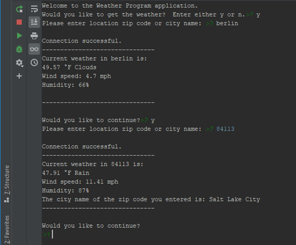

# Weather Forecasting Program  

## Introduction  
This program will return a weather forecast using the OpenWeatherMap API.  The user enters either a city name or a zip code.  The program will then return a weather forecast.  

## Data Sources Used  
No formal datasets are required for this program.  The user is encouraged to obtain their own personal OpenWeatherMap API, however.  

## Technologies Used  
* PyCharm 2018.3.5  
* OpenWeatherMap API  

## Required Packages  
```python
import requests
from uszipcode import SearchEngine
```  

## Analysis Methods Used  
* API queries  

## Summary of Results  
Here is a screenshot of the weather forecast output.  The output includes a city name example and a zip code example.  

